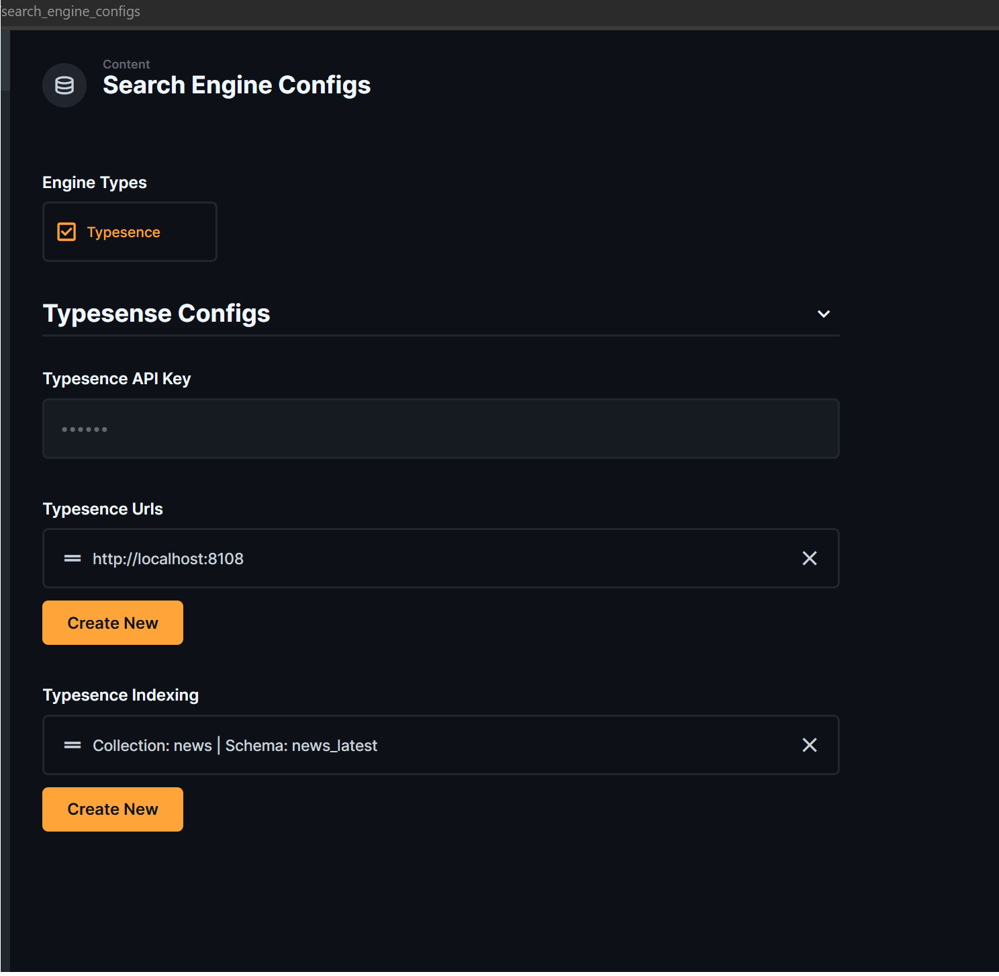
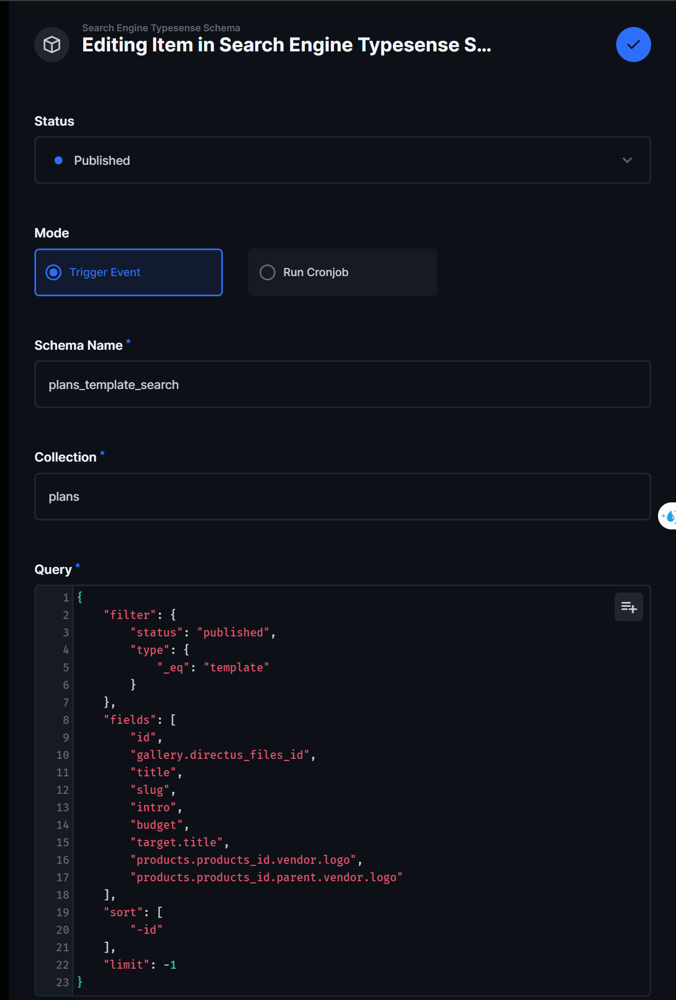
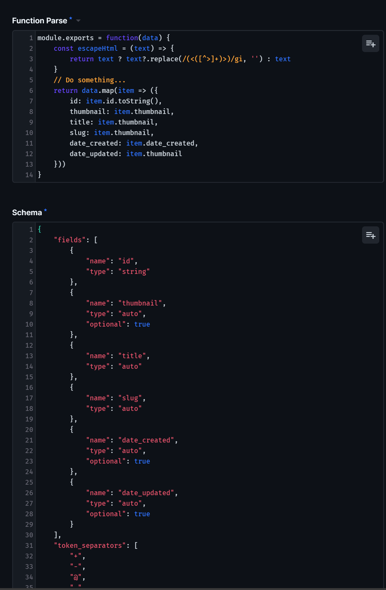
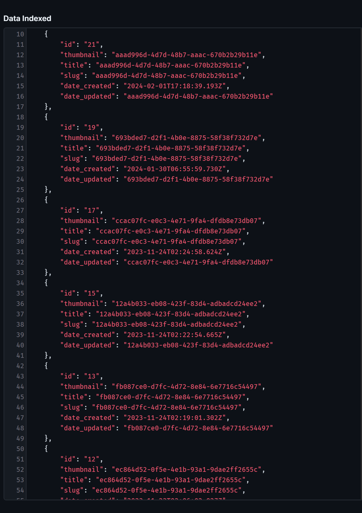

## I. Setup Docker compose & Env

```yaml
typesense:
    image: typesense/typesense:27.0.rc7
    container_name: typesense-search
    restart: always
    ports:
        - "8108:8108"
    volumes:
        - ./typesense-data:/data
    command: '--data-dir /data --api-key=$TYPESENSE_API_KEY --enable-cors'
```

``` bash
TYPESENSE_API_KEY="112233"
TYPESENSE_CRONJOB_TIME="*/15 * * * *"   #env default directus service
```

## II. Configs

**Install**
```bash
npm i directus-extension-search-engine
```



### 1. Field `Engine Type`
Allows to configure the type of search engine to be used
> **Note:** currently I only support `typesense`, in the future I will support `elasticsearch`


### 2. Field `Typesense Urls`
This field specifies the URLs of the `typesense` service. These services must all share the same API key configured in env

### 3. Field `Typesense Schema`
The processing flow here will be: get data in the query configured in `query` and `collection`, then process the data with Javascript in `Function Parse` so that the output matches the schema configured in `Schema`

#### 3.1. Status


Trigger event update:
+ ```published``` : init typesense schema + index data
+ ```draft``` or ```archived``` : drop schema + delete data index

#### 3.2. Mode

+ Mode ```Trigger Event``` : trigger hook action with the schema configured
+ Mode ```Run Cronjob``` : schema of this type will automatically index with the time configured with env ```TYPESENSE_CRONJOB_TIME```


#### 3.3. Collection
Currently, I only support queries with regular collections and **1 system collection** called ```directus_users```


#### 3.4. Query
In this step, we will get data with `directus` `sdk` query (collection & query). The returned response will be the input (`data`) of the `Function Parse` field to run the script.


> **See more:** https://docs.directus.io/reference/items.html

#### 3.5 Parse data, index schema , data indexed 




The above data will be put into `Function Parse` with the variable `data` and processed. The data needs to be processed to match the schema configured in the `schema` field. Indexed data will be saved to ```data_indexed``` for easy review.

> **Config schema:** https://typesense.org/docs/0.25.2/api/collections.html#create-a-collection
## III. Router search
### 1. Search with collection index

> **POST \<CMS url\>/search/typesense/search-collection/:collection** 

**Authorization: \<user token\>**

**Params:** collection 

**Body**
```json
{
  "q" : "stark",
  "query_by" : "title"
}

```
> **Body config:** https://typesense.org/docs/0.25.2/api/search.html#query-parameters

> **Docs:** https://typesense.org/docs/0.25.2/api/search.html


### 2. Multi-search
> **POST \<CMS url\>/search/typesense/multi-search** 

**Authorization: \<user token\>**

**Query params**
```json
{
    "query_by": "name",
}
```
> **Note:** query params will be used as `commonSearchParams` in `typesense`
(https://typesense.org/docs/0.25.2/api/federated-multi-search.html#multi-search-parameters)


**Body**
```json
{
  "q" : "stark",
  "query_by" : "title"
}
```
> **Note:** this body will be used as `searchRequests ` in `typesense`
(https://typesense.org/docs/0.25.2/api/federated-multi-search.html#multi-search-parameters)

> **Body config:** https://typesense.org/docs/0.25.2/api/search.html#query-parameters

> **Docs:** https://typesense.org/docs/0.25.2/api/search.html


### 3. Re-index data (Clear and re-index)
> **POST \<CMS url\>/search/typesense/refresh-index** 

**Authorization: \<admin token\>**

### 4. Data Indexing (with collections)
> **POST \<CMS url\>/search/typesense/index-data** 

**Authorization: \<admin token\>**

**Body**
```json
{
  "collections": ["news"]
}
```

> **Note:** If `collections` does not receive a value or the value is incorrect, collections will be assigned all configured values.


### 5. Clear data index (with collections)
> **POST \<CMS url\>/search/typesense/clear-collections** 

**Authorization: \<admin token\>**

**Body**
```json
{
  "collections": ["news"]
}
```
